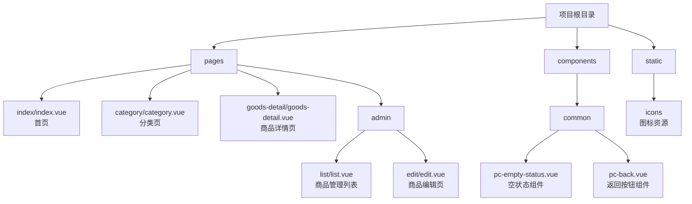

# 有友藏

有友藏是一款中古收藏的私人共享小程序。用户可以浏览、搜索各种收藏品，管理员可以管理商品信息。

## 功能特性

### 用户端
- 首页浏览
  - 分类导航
  - 商品列表
  - 下拉刷新
  - 上拉加载更多
  - 搜索商品

- 分类页
  - 分类商品列表
  - 搜索当前分类商品
  - 下拉刷新
  - 上拉加载更多

- 商品详情
  - 图片轮播
  - 商品信息展示
  - 相似商品推荐
  - 分享功能
  - 联系卖家

### 管理端
- 商品管理
  - 商品列表
  - 新增商品
  - 编辑商品
  - 删除商品
  - 下拉刷新
  - 上拉加载更多

## 技术栈

- 前端框架: UniApp (Vue 3)
- 状态管理: Vue Ref
- 云服务: LeanCloud
  - 数据存储
  - 文件存储
  - 用户系统
  - 权限管理

## 数据模型

### Category (分类)
- objectId: String
- name: String (分类名称)
- icon: String (分类图标)
- sort: Number (排序)

### Goods (商品)
- objectId: String
- name: String (商品名称)
- description: String (商品描述)
- price: Number (价格)
- images: Array<String> (商品图片)
- categoryRef: Pointer<Category> (所属分类)
- createdAt: Date (创建时间)
- updatedAt: Date (更新时间)

## 项目结构

## 开发说明

1. 克隆项目
2. 使用 HBuilderX 打开项目
3. 配置 LeanCloud 参数
4. 微信小程序运行项目

## License

MIT